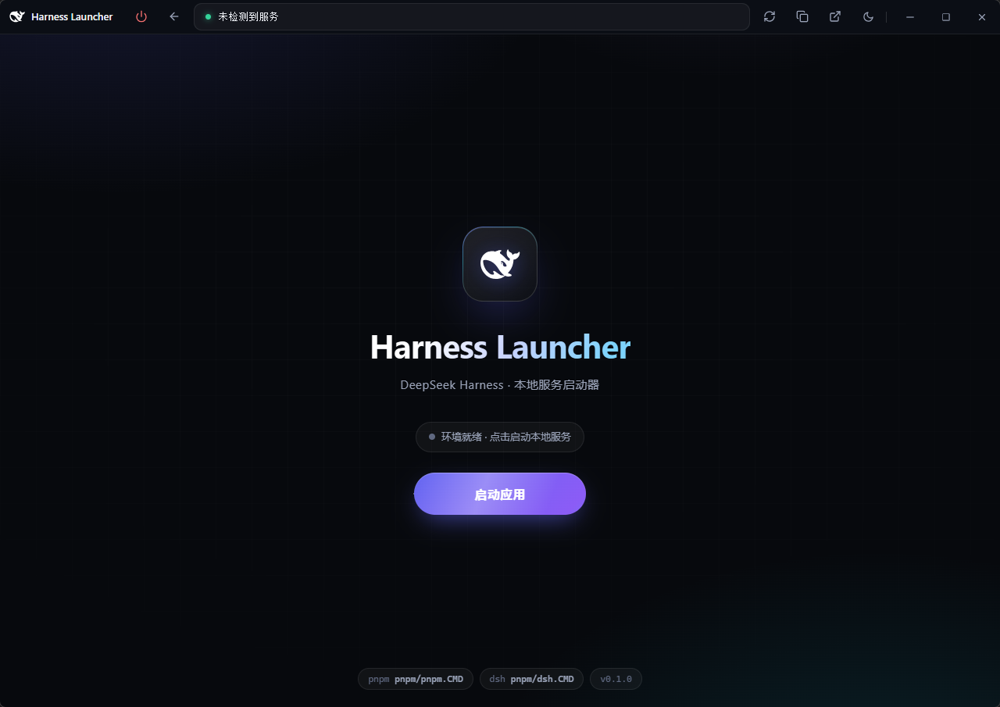

# DeepSeek Harness Desktop

> 本地 **DeepSeek Harness** 网页服务的轻量桌面壳——一键安装、启动、监控与内嵌预览本地服务，关闭后驻留系统托盘持续运行。

[](https://tauri.app)
[](https://react.dev)
[]()
[](https://github.com/jsoncode/deepseek-harness-desktop/releases/latest)



📸 [查看全部界面截图 →](docs/preview.md)

---

## 📥 下载安装

面向新用户：直接下载对应平台的安装包，双击安装即可，无需自己动手搭建环境。

| 平台 | 安装包 | 大小 |
| --- | --- | --- |
| Windows 10/11（64 位） | [下载 .exe（NSIS 安装包）](https://github.com/jsoncode/deepseek-harness-desktop/releases/latest) | ~2.0 MB |
| macOS Apple Silicon | [下载 .dmg](https://github.com/jsoncode/deepseek-harness-desktop/releases/latest) / [下载 .pkg](https://github.com/jsoncode/deepseek-harness-desktop/releases/latest) | ~2.9 MB |
| macOS Intel（64 位） | [下载 .dmg](https://github.com/jsoncode/deepseek-harness-desktop/releases/latest) / [下载 .pkg](https://github.com/jsoncode/deepseek-harness-desktop/releases/latest) | ~3.0 MB |

> 所有安装包统一发布在 [GitHub Releases](https://github.com/jsoncode/deepseek-harness-desktop/releases/latest)，选择最新版本、下载对应平台的安装包即可。

> 💡 **轻量**：以上为 v0.1.2 实测大小（Windows 2.02 MB、macOS 2.91~3.01 MB），各版本略有差异——全平台安装包都只有 2~3 MB，秒级下载、秒级安装。

**首次使用（两步完成）**：

1. 安装 [Node.js](https://nodejs.org/) ≥ 22.19 与 [pnpm](https://pnpm.io/zh-CN/installation)——应用会自动执行 `pnpm add -g @deepseek-ai/dsh@latest` 安装 DSH 并启动本地服务；
2. 打开应用，点击「启动应用」手动启动服务（启动页展示 dsh CLI 版本与安装/启动进度），服务就绪后点击「打开应用」进入预览页。

> - Windows 若提示 SmartScreen，请选择「更多信息 → 仍要运行」。
> - macOS 应用未签名，首次打开需在「系统设置 → 隐私与安全性」中点击「仍要打开」，或右键应用选择「打开」。

---

## ✨ 亮点

- **安装包极小** — 全平台安装包仅 **2~3 MB**（Windows NSIS 约 2 MB、macOS DMG/PKG 约 3 MB），秒级下载、秒级安装（对比 Electron 应用动辄上百 MB）。
- **一键启动** — 自动全局安装 `@deepseek-ai/dsh`（pnpm）并启动本地网页服务，无需任何手动配置。
- **智能服务检测** — 探测默认端口，且只认自家子进程输出中提及的 URL，绝不误连外部已运行的实例。
- **流式终端** — macOS 风格模拟终端，实时输出安装/启动日志，支持停止、重启与崩溃提示。
- **内嵌预览** — iframe 内嵌本地 DSH 网页，带健康轮询、刷新、复制地址、浏览器打开等功能。
- **系统托盘** — 关闭窗口隐藏到托盘持续服务；托盘菜单（打开 / 浏览器中打开 / 退出）与单实例恢复。
- **自绘标题栏** — 支持拖拽、双击最大化，并在 Windows 11 上提供**原生磁吸布局预览**（悬停最大化按钮触发 Snap Layouts）。
- **深浅主题** — 暗色/浅色自动跟随系统，支持手动三态切换。
- **调试/正式隔离** — 调试构建使用独立 app id 与端口（6088），与正式版（3080）互不干扰。
- **自动发布** — GitHub Actions 从版本标签自动构建并发布 Windows NSIS 与 macOS 安装包。

## 🔗 相关链接

| 链接 | 说明 |
| --- | --- |
| [DeepSeek Harness 官网](https://www.deepseek.com/harness/) | 产品官网 |
| [GitHub 仓库](https://github.com/deepseek-ai/deepseek-harness) | DeepSeek Harness 官方开源仓库 |
| [开发者文档](https://deepseek-harness.github.io/deepseek-harness/guide/quickstart) | 快速上手指南 |
| [插件开发](https://deepseek-harness.github.io/deepseek-harness/develop/basic/) | 插件开发文档 |

## 🚀 快速开始

### 环境要求

- [Node.js](https://nodejs.org/) ≥ 22.19 与 [pnpm](https://pnpm.io/)
- [Rust](https://www.rust-lang.org/) 工具链（stable），Tauri 需要
- Windows 10/11 或 macOS（未预配置 Linux 构建）

> 💡 换新设备/新环境后若报 `cargo metadata ... program not found`，说明 Rust 工具链未安装。
> 构建前会先执行 `scripts/check-rust.mjs` 自检并给出安装指引（Windows 可运行
> `winget install Rustlang.Rustup` 后重开终端）。

### 开发运行

```bash
pnpm install
pnpm tauri:dev        # 开发模式（Vite + Tauri），app id: com.deepseek.harness.desktop.dev
pnpm tauri:debug      # 开发模式 + RUST_BACKTRACE / WebView2 日志
```

> 开发模式下，壳层 UI 运行在 Vite dev server `http://localhost:6089`（支持浏览器预览），
> 由本应用托管的 `dsh web` 服务运行在 **6088** 端口。

### 构建打包

```bash
pnpm tauri:build               # 当前平台全量打包
pnpm tauri:build:win           # Windows NSIS 安装包（.exe）
pnpm tauri:build:mac           # macOS DMG
pnpm tauri:build:mac:app       # macOS .app
pnpm tauri:build:mac:universal # macOS 通用（universal-apple-darwin）DMG
```

> Windows 打包依赖离线 NSIS 工具链：`scripts/setup-nsis.mjs` 会把 `libs/` 中的
> `nsis-3.11.zip` + `nsis_tauri_utils.dll`（SHA1 校验）部署到
> `%LOCALAPPDATA%\tauri\NSIS`，构建全程不访问网络。

## 🚢 发布（GitHub Actions）

推送 `v*` 标签即可自动构建并**直接发布**（非草稿）Windows / macOS 安装包：

```bash
git tag v0.1.0
git push origin v0.1.0
```

或使用一键发布脚本（自动 bump 版本 → 同步版本文件 → 提交 → 打标签 → 推送）：

```bash
pnpm release               # 自动 bump patch 并发布（0.1.0 → 0.1.1）
pnpm release 0.2.0         # 指定版本发布
pnpm release minor         # bump minor 并发布
pnpm release:tag-only      # 仅给当前版本打标签推送（不 bump）
```

流水线（`.github/workflows/release.yml`）：质量门禁（tsc + vite 构建 + Rust 测试）→ 创建**已发布**的正式 Release → 矩阵构建（Windows NSIS / macOS arm64 / macOS x64）并把安装包追加到同一 Release。

## 🖥 使用说明

| 页面 | 说明 |
| --- | --- |
| `/` 启动页 | 居中 logo + 环境预检卡片（Node.js / pnpm / dsh CLI 版本）+ 主按钮。已有服务运行时显示 **打开应用**，否则显示 **启动应用**（手动点击后才启动，不在进入页面时自动启动）。 |
| `/terminal` 终端页 | 流式输出全局安装（`pnpm add -g @deepseek-ai/dsh@latest`）与 `dsh web` 启动日志；进入页面不会自动启动服务，仅查看日志。 |
| `/preview` 预览页 | iframe 内嵌本地服务，支持刷新 / 复制地址 / 浏览器打开；服务断连时标题栏指示灯变红。 |

系统托盘（右键菜单）：**打开** 恢复窗口，**浏览器中打开** 用默认浏览器打开服务地址，**退出** 停止服务并结束进程。

## 🧱 技术栈

Tauri 2 · Rust · Vite 8 · React 19 · Ant Design 6 · React Router · Zustand

## 📁 目录结构

```
src/                前端（React + Zustand + React Router）
  pages/            Launch / Terminal / Preview
  store/            应用状态机与事件接线
  lib/tauri.ts      Tauri invoke/event 桥接
src-tauri/          Rust 后端
  src/dsh.rs        工具解析、进程管理、日志泵、URL 探测
  capabilities/     权限声明
scripts/            setup-nsis（离线 NSIS）/ sync-version / release-tag / verify-*
libs/               离线 NSIS 工具链（nsis-3.11.zip + nsis_tauri_utils.dll）
```

## 📄 说明

- `dsh web` 默认监听 `127.0.0.1:3080`（正式版）；应用通过解析其 stdout 的 `http://...` 行 + TCP 探活确认服务就绪。
- 预览页使用 iframe 内嵌（本地服务无 `X-Frame-Options` 限制）；应用 CSP 已放行 `frame-src http://127.0.0.1:* http://localhost:*`。
- 调试构建完全隔离：app id `com.deepseek.harness.desktop.dev`、服务端口 6088、UI 端口 6089。

## 📖 其他语言

- [English README](README.en.md)
